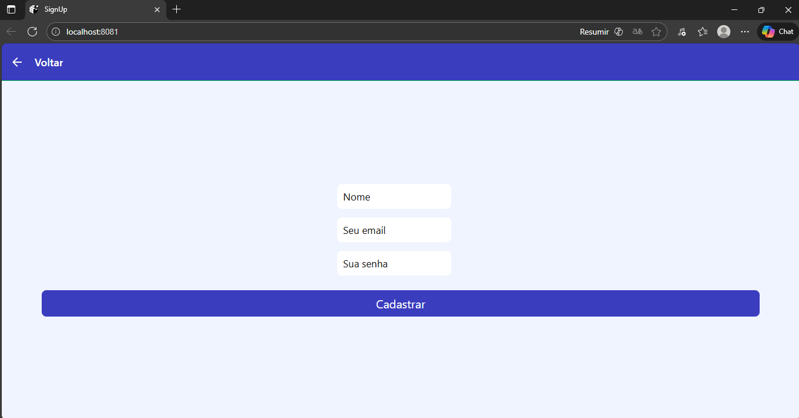
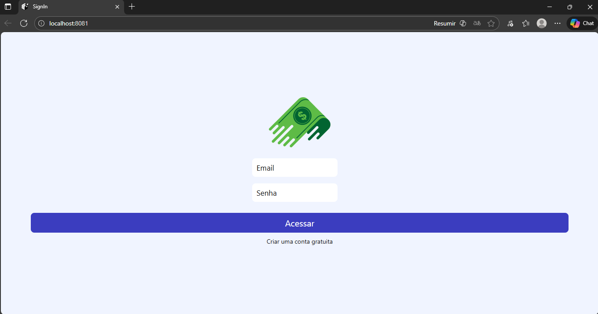
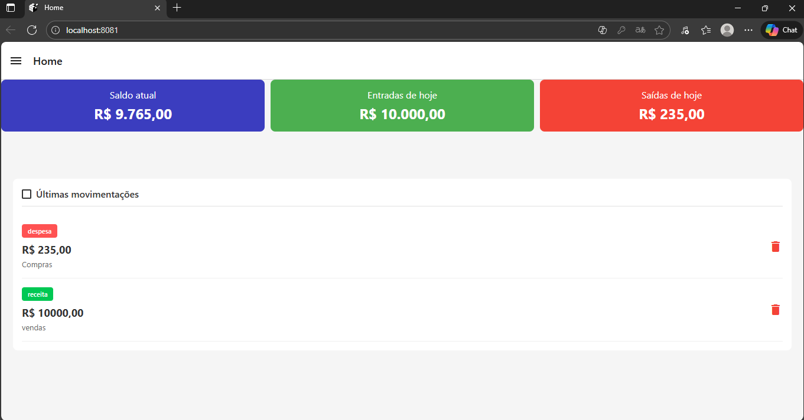
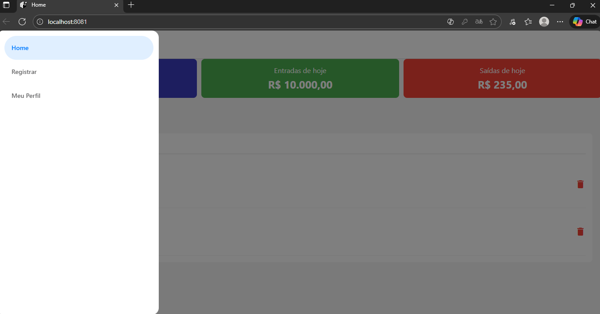
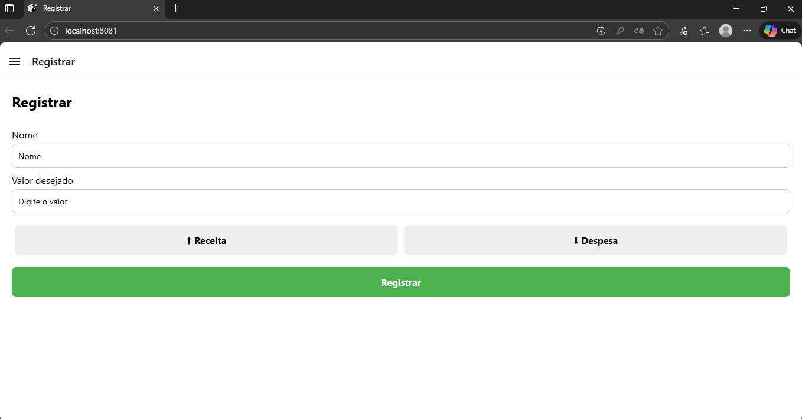

# 📱 Sistema de Finanças

Aplicativo de **finanças pessoais** desenvolvido em **React Native**, com foco em controle de saldo, cadastro de transações e autenticação de usuários.  
Este projeto foi criado como parte da disciplina de Dispositivos Móveis.

---

## 🚀 Funcionalidades

- 📊 **Visualização de saldo** e lista de transações
- ➕ **Cadastro de entradas e saídas**
- 🔐 **Autenticação de usuários** (login e cadastro)
- 🧩 **Componentes reutilizáveis** para melhor organização
- 🌐 **Integração com API** via Axios
- 🎨 **Estilização modular** com arquivos `styles.js`

---

## Telas

- Tela inicial de Cadastro

---

- Tela inicial de Login

---

- Tela inicial Home

---

- Barra Lateral

---

- Tela de Registro (Receitas ou Despesas)

---

### Video do App funcionando:

- https://drive.google.com/file/d/1WaxWSyO66ZVKwRp8dCe_YL2d7YoFguQP/view?usp=sharing

## 🛠️ Tecnologias Utilizadas

- [React Native](https://reactnative.dev/)
- [Context API](https://react.dev/reference/react/useContext)
- [Axios](https://axios-http.com/)
- [React Navigation](https://reactnavigation.org/)

---

## Grupo - PS A SISTEMAS PARA INTERNET:

- Anderson Victor Oliveira de Barros;
- Felipe Queiroz Pinto;
- João José Alves Neto;
